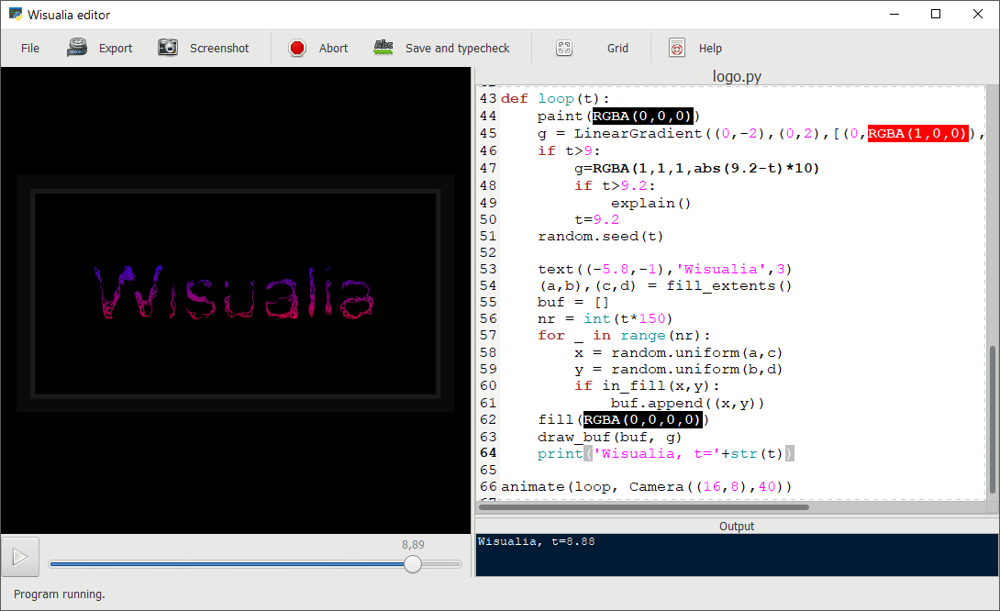

# Wisualia

A program for generating animations with Python code.

**Warning: This program is an experimental prototype. It contains bugs and it
will change.**

## Video demonstrations

[Music](https://drive.google.com/file/d/1gINp70u-eQRgfnvW8uBCKh6BwseNTlOj/view?usp=sharing)

[Logo](https://drive.google.com/file/d/1cb8EMM3VbfaFFBTloVPUjSDB0aH_ccT9/view?usp=sharing)

[Tree](https://drive.google.com/file/d/1dlab2ehdO7jPFDwbtm4RZxyXlvtcu37P/view?usp=sharing)

## Installation

### Windows

There are two installation options for Windows. Both of them include installing
a new Python interpreter, entire GTK3, Pyglet and some other packages. The first
option is certainly easier.

1. Download a windows bundle from the
   [releases page](https://github.com/rt-tondilt/wisualia/releases).
2. Follow complex
   [installation instructions](msys2_installation_instructions.md)
   for MSYS2 based environment.

### GNU/Linux

These instructions are easier than the MSYS2 ones and the application will take
less disk space if you have Python and GTK3 already installed. On the other hand,
this version is less tested and can't play sound files.

[GNU/Linux installation instructions (APT).](gnu_linux_installation_instructions.md)

## [Tutorial and API documentation.](https://rt-tondilt.github.io/wisualia_documentation/)

## Overview

Wisualia has two main components the Wisualia application and the wisualia library.
Wisualia application executes user programs and user programs import wisualia
library. This library is a type-checked Python library and uses
[pycairo](https://pycairo.readthedocs.io/en/latest/) for drawing. Wisualia
library aims to be more user friendly and suitable for rapid programming than
pycairo. Wisualia library is currently **not** available on PyPI.

## Warning

Do not open untrusted Python programs with Wisualia. Their are **not** executed
in a sandbox.
